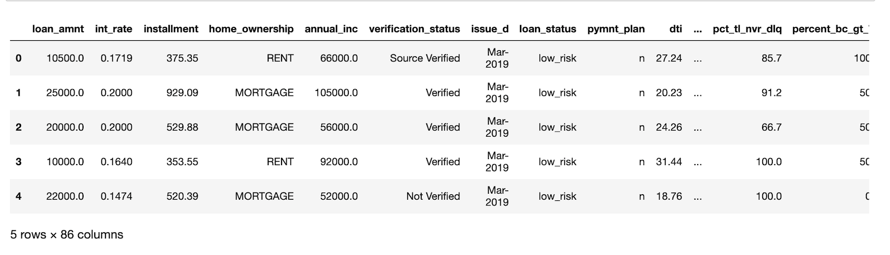
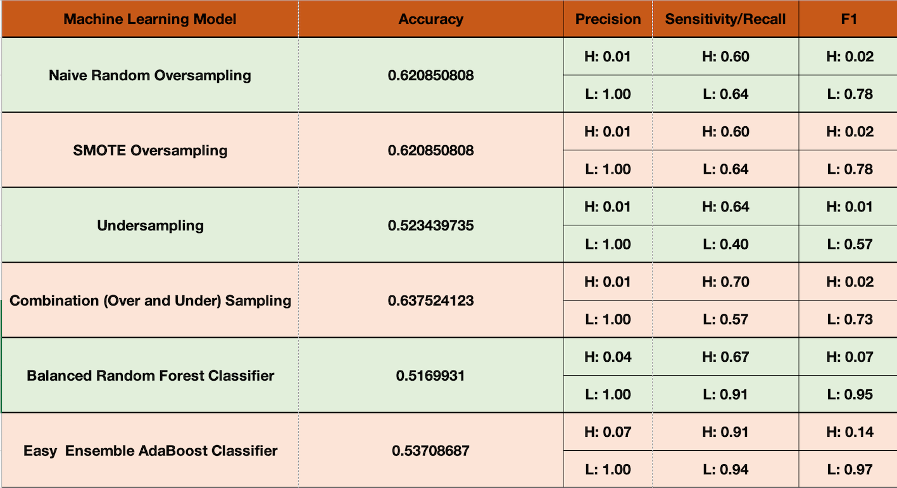

# Credit_Risk_Analysis

## Overview of analysis:
Credit risk is an inherently unbalanced classification problem, as good loans easily outnumber risky loans. Therefore, you’ll need to employ different techniques to train and evaluate models with unbalanced classes. 
Using the credit card credit dataset from LendingClub, We suposed to use different machine learning models to predict credit risk.

## Results:
Below is the combination of all Models result based on the imbalanced classification reports:

- The last 2 Ensemble Models work better in high_risk situation, 
- As the table shows, all the models scores are low in high_risk prediction. It means the precision is low in high_risk class.
- All the models scores are high in low_risk prediction. It means the precision is high in row_risk class.

## Summary:

Among those different models we used on our dataset, Easy Ensemble AdaBoost Classifier worked better in both low and High_risk predictions.
